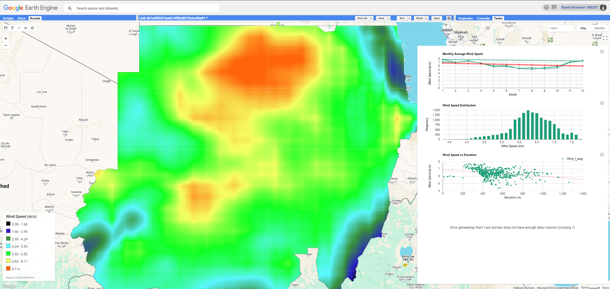
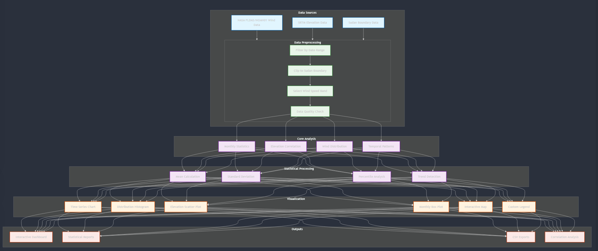
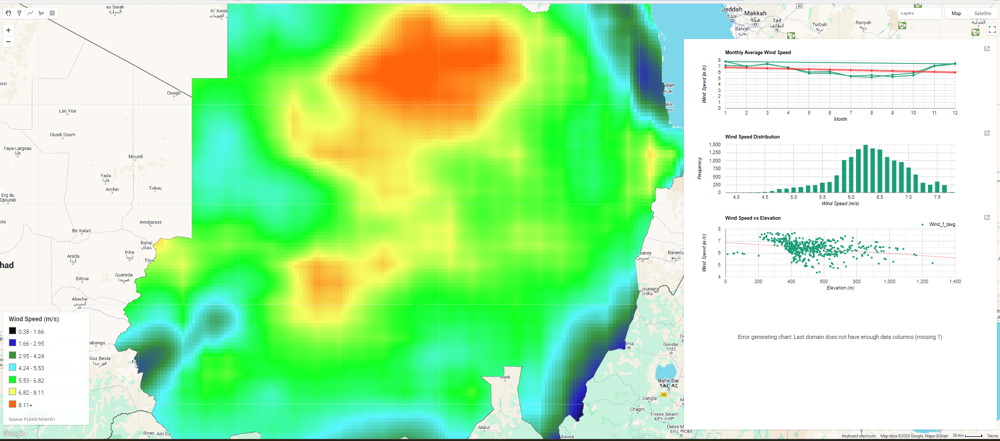

# Sudan-Wind-Analysis-Tool

## Overview

This Google Earth Engine (GEE) application provides comprehensive wind speed analysis for Sudan using NASA FLDAS/NOAH01 data. The tool offers interactive visualization, statistical analysis, and correlation studies between wind patterns and geographical features.

# Features
1. Wind Speed Analysis

* Monthly average wind speed calculations
* Temporal trend analysis
* Statistical distribution visualization
* Wind speed variability assessment

2. Advanced Visualizations

* Interactive time series charts
* Wind speed distribution histograms
* Elevation correlation scatter plots
* Monthly variation box plots

3. Data Integration

* Wind speed data from NASA FLDAS/NOAH01
* Elevation data from SRTM
* Administrative boundaries from USDOS/LSIB

4. Statistical Features

* Monthly statistics computation
* Standard deviation analysis
* Percentile calculations (10th and 90th)
* Trend line analysis

5. Export Capabilities

* CSV export of wind statistics
* Wind-elevation correlation data
* Custom region analysis results

# Prerequisites

* Google Earth Engine account
* Access to the following datasets:
    1. NASA/FLDAS/NOAH01/C/GL/M/V001
    2. USGS/SRTMGL1_003
    3. USDOS/LSIB_SIMPLE/2017

# Data Sources

* Wind Data: NASA FLDAS/NOAH01 (2006-2007)
* Elevation: SRTM Digital Elevation Model
* Administrative Boundaries: USDOS LSIB Simple Boundaries

# Methodology 

# Results 

## License
This project is open-source and available under the MIT License.
